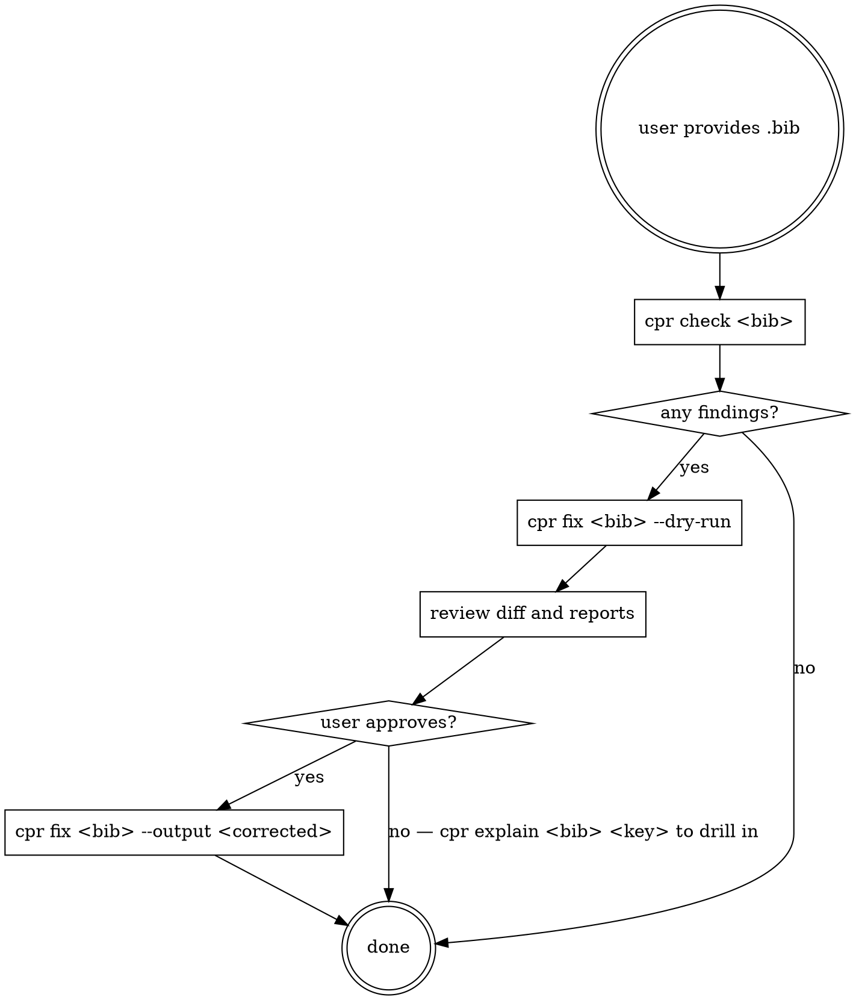

# correct-paper-reference

> Evidence first, LLM second — never hallucinate metadata.

You are the agent-facing entry point for CPR. When the user asks about
a `.bib` file or citation metadata, use the CPR CLI installed as `cpr`.
Do not manually edit BibTeX entries: pass everything through the CLI so
that every non-trivial change is backed by evidence and a confidence
label.

**Phase 1 scope.** This Skill covers what the CLI ships today. Later
phases (browser extension, web app, LaTeX semantic audit) are separate
Skills.

## Workflow

## Rules (do not violate)

1. **Never rewrite an entry manually.** Always shell out to `cpr fix`
   with a confidence gate — the CLI enforces the no-hallucination
   invariant.
2. **Preserve citation keys.** The default profile is
   `citation_key.strategy: preserve`. Never pass `--regenerate-keys`
   unless the user explicitly asks.
3. **Interactive mode for medium confidence.** If `cpr check` reports
   findings at `medium` confidence, run `cpr fix --interactive` and
   surface each prompt to the user with the before/after/reason from
   `cpr explain <bib> <key>`.
4. **Low-confidence findings are never auto-applied.** Report them; do
   not attempt to fix them.
5. **Read every generated report.** After `cpr fix`, the CLI writes
   `reference-audit.md` and `reference-audit.json` next to the output.
   Read them before summarizing to the user.

## Commands you can run

| Command                                                 | Purpose |
|---------------------------------------------------------|---------|
| `cpr check <bib>`                                       | Read-only audit + print summary. |
| `cpr check <bib> --report audit.md --json audit.json`   | Persist a report. |
| `cpr fix <bib> --dry-run`                               | Show what would change without writing. |
| `cpr fix <bib> --output <path>`                         | Apply verified+high fixes. |
| `cpr fix <bib> --interactive`                           | Prompt per medium finding. |
| `cpr fix <bib> --in-place --backup`                     | Overwrite with `.bak`. |
| `cpr verify <bib> <key>`                                | Deep-dive one entry (all evidence records). |
| `cpr explain <bib> <key>`                               | Human-readable per-entry report. |

Global flags: `--no-network`, `--cache-dir`, `--config`, `--profile
sjtu-ectl`, `-v/-vv`.

## Reporting to the user

When done, tell the user:
- how many entries were scanned,
- how many findings were emitted, broken down by type,
- which findings were auto-applied (verified/high) and which were left,
- the path to `reference-audit.md`.

If the user asks "why did you change X?", open `reference-audit.md`
(or use `cpr explain`) and read back the `{before, after, reason,
evidence, confidence}` block.
