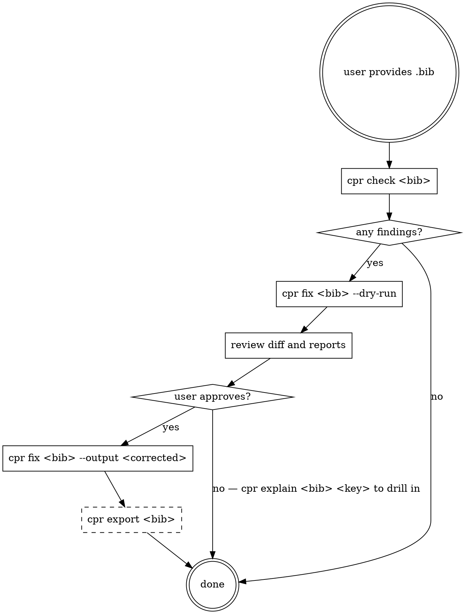

# correct-paper-reference (bibcpr)

> Evidence first, LLM second — never hallucinate metadata.

You are the agent-facing entry point for **bibcpr**. When the user asks
about a `.bib` file or citation metadata, use the CLI installed as
`cpr`. Do not manually edit BibTeX entries: pass everything through
the CLI so that every non-trivial change is backed by evidence and a
confidence label.

- Repo: <https://github.com/959AI994/bibcpr>
- Contact: Jingxin Wang · <jingxin.wang@sjtu.edu.cn>

## Workflow



## Rules (do not violate)

1. **Never rewrite an entry manually.** Always shell out to `cpr` — the
   CLI enforces the no-hallucination invariant.
2. **Preserve citation keys.** The default profile is
   `citation_key.strategy: preserve`. Never pass `--regenerate-keys`
   unless the user explicitly asks.
3. **Interactive mode for medium confidence.** If `cpr check` reports
   findings at `medium` confidence, run `cpr fix --interactive` and
   surface each prompt to the user with the before/after/reason from
   `cpr explain <bib> <key>`.
4. **Low-confidence findings are never auto-applied.** Report them; do
   not attempt to fix them.
5. **LLM never provides evidence.** LLMs are only allowed to do
   *routing* (tie-break between two evidence-backed candidates, or
   sanity-check that a serialized entry looks well-formed). Any
   metadata field that survives to `.verified.bib` must be attested
   by at least one Crossref/DBLP/arXiv/OpenReview record.
6. **Read every generated report.** After `cpr fix` or `cpr export`,
   the CLI writes companion reports (`reference-audit.md`,
   `*.export-summary.md`). Read them before summarizing to the user.

## Commands you can run

| Command                                               | Purpose |
|-------------------------------------------------------|---------|
| `cpr check <bib>`                                     | Read-only audit + print summary. |
| `cpr check <bib> --report audit.md --json audit.json` | Persist a report. |
| `cpr fix <bib> --dry-run`                             | Show what would change without writing. |
| `cpr fix <bib> --output <path>`                       | Apply verified+high fixes. |
| `cpr fix <bib> --interactive`                         | Prompt per medium finding. |
| `cpr fix <bib> --in-place --backup`                   | Overwrite with `.bak`. |
| `cpr verify <bib> <key>`                              | Deep-dive one entry (all evidence records). |
| `cpr explain <bib> <key>`                             | Human-readable per-entry report. |
| `cpr export <bib> --out-dir <dir>`                    | Split into `.verified.bib` + `.needs-review.bib`. |
| `cpr serve`                                           | Launch local web UI (127.0.0.1:8765). |

Global flags: `--no-network`, `--cache-dir`, `--config`, `--profile
sjtu-ectl`, `-v/-vv`.

## `cpr export` — verified BibTeX

`cpr export` is the recommended output when the user says
*"give me a bib I can paste straight into my paper"*. It splits the
input into two files by strict verification criteria:

- `<name>.verified.bib` — every entry has:
  - a strong identity (DOI, arXiv id, or OpenReview id)
  - at least one evidence record from a tier-A/B/C provider
  - no unresolved conflicts
  - no `error`/`critical` findings
  - passed the LLM sanity-check (when an LLM is configured)
- `<name>.needs-review.bib` — everything else, with a `note = {...}`
  field explaining why it did not qualify.
- `<name>.export-summary.md` — a per-entry table.

**Flags:**

```
cpr export <bib>                       # default: writes to same dir, verified+needs-review
cpr export <bib> --out-dir ./out       # write to ./out/
cpr export <bib> --llm off             # skip LLM sanity-check
cpr export <bib> --llm deepseek        # use DeepSeek (reads DEEPSEEK_API_KEY or ./deepseekkey)
cpr export <bib> --llm openai          # use OpenAI (reads OPENAI_API_KEY)
cpr export <bib> --llm anthropic       # use Anthropic (reads ANTHROPIC_API_KEY)
cpr export <bib> --no-network          # offline (no evidence → most entries end up in needs-review)
```

When `--llm` is unset, `cpr` auto-detects the first available key in
the order: DEEPSEEK_API_KEY → local `deepseekkey` file →
OPENAI_API_KEY → ANTHROPIC_API_KEY. If none are found, the sanity
check is skipped (does not block export).

## Environment variables

| Variable            | Purpose |
|---------------------|---------|
| `DEEPSEEK_API_KEY`  | DeepSeek OpenAI-compatible chat endpoint. |
| `OPENAI_API_KEY`    | OpenAI. |
| `ANTHROPIC_API_KEY` | Anthropic. |
| `CPR_LLM_MODEL`     | Override default model name for the selected provider. |
| `CPR_CACHE_DIR`     | Persistent cache dir (default `~/.cache/cpr/`). |

A `./deepseekkey` file in the current directory is also honored (one
key per line, first line wins). This is the fallback when
`DEEPSEEK_API_KEY` is not exported.

## Reporting to the user

When done, tell the user:
- how many entries were scanned,
- how many findings were emitted, broken down by type,
- for `cpr fix`: which findings were auto-applied (verified/high) and which were left,
- for `cpr export`: how many entries went to `.verified.bib` vs `.needs-review.bib` and the top reasons,
- the paths to the generated `.md` / `.json` reports.

If the user asks "why did you change X?" or "why isn't X in
`.verified.bib`?", open the audit / export summary (or use
`cpr explain <bib> <key>`) and read back the
`{before, after, reason, evidence, confidence}` block.
